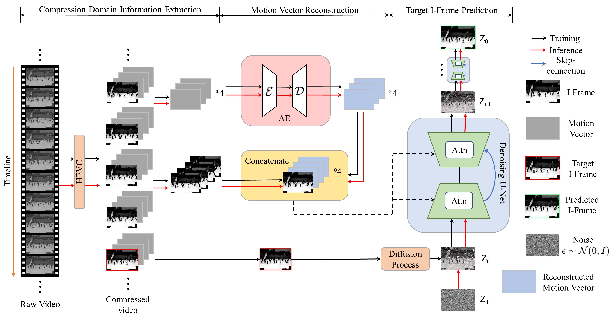

# VADiffusion: Compressed Domain Information Guided Conditional Diffusion for Video Anomaly Detection

**Accepted by IEEE Transactions on Circuits and Systems for Video Technology (TCSVT)**

[](https://ieeexplore.ieee.org/document/10480695)

## 📖 Overview

The demand for security surveillance has grown exponentially, making video anomaly detection particularly crucial. Existing image-domain based anomaly detection algorithms face implementation challenges due to several drawbacks, including latency during long-distance transmission, the need for complete decoding, and the complexity of network inference structures. Moreover, current frame prediction methods using generative models suffer from low prediction quality and mode collapse.
To tackle these challenges, we propose **VADiffusion**, a compressed domain information guided conditional diffusion framework. VADiffusion adopts a dual-branch structure that combines motion vector reconstruction and I-frame prediction, effectively addressing the limitations of the reconstruction method in identifying sudden anomalies and the struggles of the frame prediction method in detecting persistent anomalies. Furthermore, our proposed framework incorporates the diffusion model into the realm of video anomaly detection, thereby improving the stability and accuracy of the model.
Specifically, we employ sparse sampling of the compressed video, utilizing I-frames to capture appearance information and motion vectors to represent motion-related details. Different from the existing independent two-branch mechanism, we adopt a reconstruction-assisted prediction strategy, leveraging I-frames and the reconstructed motion vectors from the reconstruction branch as conditions for the diffusion model utilized in frame prediction. Ultimately, we perform decision fusion of reconstruction and prediction branches to determine anomalies. Through extensive experiments, we demonstrate that our algorithm achieves an effective trade-off between detection accuracy and model complexity.

## 🏗️ Framework


*Figure 1: The overall framework of VADiffusion.*

## 🛠️ 1. Environment Setup

To set up the environment, please follow these steps:

```bash
# 1. Clone the repository
git clone https://github.com/LHaoooo/VADiffusion.git
cd VADiffusion

# 2. Create and activate the conda environment
conda create -n vad python=3.8
conda activate vad

# 3. Install PyTorch and CUDA toolkit
conda install pytorch==1.12.1 torchvision==0.13.1 torchaudio==0.12.1 cudatoolkit=11.3 -c pytorch

# 4. Install other dependencies
pip install -r requirements.txt
pip install xlwt scikit-learn
```

## 💾 2. Dataset and Preprocessing
### Dataset Availability
Due to storage limitations, we only provide the pre-processed **UCSD_ped2** dataset. You can download it from the following link:

* [**UCSD_ped2 (Pre-processed)**](https://drive.google.com/drive/folders/1wbi2HmxXMZ0GMTJyyaY5j09JTVIUbgzN?usp=drive_link)

### Data Preprocessing Pipeline

The preprocessing pipeline consists of three main steps:
1.  **Convert AVI to YUV420**: Convert original videos to YUV420 format.
2.  **Encoding**: Input YUV files to generate compressed bitstreams (`.bin`) and reconstructed YUV files.
3.  **Decoding (MV Extraction)**: Input `.bin` files to obtain reconstructed YUVs and extract Motion Vectors (MVs) in the same directory.

#### Prerequisites

Before starting, ensure your original video datasets are converted to **256x256 resolution AVI format**.

#### Step 1: Convert AVI to YUV

Navigate to the `HM-16.20+SCM-8.8/bin` directory and use `avitoyuv.sh` to batch convert your AVI dataset.

```bash
cd VADiffusion/HM-16.20+SCM-8.8/bin
# Usage: ./avitoyuv.sh [source_avi_dir] [target_yuv_dir]
./avitoyuv.sh /home/abnormal_dataset/UCSD_ped2_256/train_videos /home/abnormal_dataset/UCSD_ped2_256/train_yuv
```

#### Step 2: Encoding (Generate .bin and reconstructed YUV)

Still in the `HM-16.20+SCM-8.8/bin` directory, perform encoding.
* For **UCSD_ped2**, use `yuv400tobin.sh`.
* For **Avenue** and **ShanghaiTech**, use `yuvtobin.sh`.

**For UCSD_ped2:**
```bash
# Usage: ./yuv400tobin.sh [source_yuv_dir] [target_bin_dir] [target_recyuv_dir]
./yuv400tobin.sh /home/abnormal_dataset/UCSD_ped2_256/train_yuv400 /home/abnormal_dataset/UCSD_ped2_256/train_bin400 /home/abnormal_dataset/UCSD_ped2_256/train_recyuv400
```

**For Avenue / ShanghaiTech:**
```bash
# Usage: ./yuvtobin.sh [source_yuv_dir] [target_bin_dir] [target_recyuv_dir]
./yuvtobin.sh /home/abnormal_dataset/avenue_256/train_yuv /home/abnormal_dataset/avenue_256/train_bin /home/abnormal_dataset/avenue_256/train_recyuv
```

#### Step 3: Decoding (Extract Motion Vectors)

Finally, use `decode_bin.sh` in the same directory to decode the bitstreams and extract Motion Vectors (MVs).

```bash
# Usage: ./decode_bin.sh [source_bin_dir] [target_recyuv_dir_from_step2]
./decode_bin.sh /home/abnormal_dataset/UCSD_ped2_256/train_bin400 /home/abnormal_dataset/UCSD_ped2_256/train_recyuv400
```

After these steps, your data preprocessing is complete, and MVs will be available in the specified reconstructed YUV directories.

## 🚀 3. Usage

Our training process consists of two parts: **MV Reconstruction** and **Frame Prediction (Diffusion)**.

### Part 1: MV Reconstruction Training

For MV reconstruction, you need to modify the `create_argparser` function in `MV_recon_train.py`.

**Key parameters to modify:**
* `ImgChnNum`: Use **1** for UCSD_ped2, and **3** for Avenue and ShanghaiTech.
* `dataset_base_dir`: The root directory of your dataset (must contain `reyuv` and `mv_txt` subdirectories).
* `dataset_name`: The name of the dataset you are using (e.g., `"UCSD_ped2"`, `"avenue"`).
* `exp_name`: The name of the experiment, used for saving checkpoints and logs.
* `pretrained`: Path to a pretrained model if you want to resume training, otherwise set to `False`.

```python
# Example modification in MV_recon_train.py
def create_argparser():
    defaults = dict(
        # ... other settings ...
        ImgChnNum = 3, # 1 for UCSD_ped2, 3 for others
        dataset_base_dir = "/home/Dataset/Avenue", # Update to your dataset path
        dataset_name = "avenue",
        exp_name = "avenue_mv_recon_experiment",
        pretrained = False,
        # ... other settings ...
    )
    # ...
```

**Start Training:**
```bash
python MV_recon_train.py
```

**Evaluation:**
After training, use `MV_recon_eval.py` to evaluate the model and select the best weights. Ensure the parameters in `MV_recon_eval.py` match your training configuration.
```bash
python MV_recon_eval.py
```

### Part 2: Frame Prediction (Diffusion) Training & Testing

After obtaining the best MV reconstruction weights, you can proceed to train and test the diffusion model for frame prediction.

You need to modify the arguments in `frame_pred.py` or pass them via command line.

**Key Arguments:**
* `--config`: Path to the YAML config file for the specific dataset (e.g., `configs/Avenue_ddpm.yml`). **Remember to also update the corresponding YAML file with your specific paths and settings.**
* `--data_path`: The base path to your dataset.
* `--exp`: Experiment name for saving results.
* `--train`: Flag to start training.
* `--test`: Flag to test all checkpoints in the experiment directory.
* `--singletest`: Flag to test a specific checkpoint.
* **Note:** You also need to define/modify `args.log_path` in the code as needed.

**Training Example:**
```bash
python frame_pred.py --train --config configs/Avenue_ddpm.yml --data_path /home/Dataset/Avenue --exp exp_avenue_diffusion
```

**Testing All Checkpoints:**
```bash
python frame_pred.py --test --config configs/Avenue_ddpm.yml --data_path /home/Dataset/Avenue --exp exp_avenue_diffusion
```

**Testing a Single Checkpoint:**
```bash
# You might need to specify the checkpoint path in the config or code for singletest depending on your implementation
python frame_pred.py --singletest --config configs/Avenue_ddpm.yml --data_path /home/Dataset/Avenue --exp exp_avenue_diffusion
```

## 📝 4. Citation

If you find this code or paper useful in your research, please consider citing:

```bibtex
@article{liu2024vadiffusion,
  title={Vadiffusion: Compressed domain information guided conditional diffusion for video anomaly detection},
  author={Liu, Hao and He, Lijun and Zhang, Miao and Li, Fan},
  journal={IEEE Transactions on Circuits and Systems for Video Technology},
  volume={34},
  number={9},
  pages={8398--8411},
  year={2024},
  publisher={IEEE}
}
```

Finally, if you encounter any issues or have questions, feel free to open an issue.
